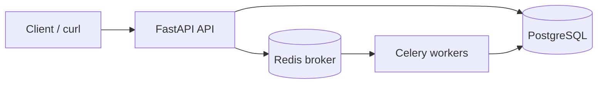

# TaskFlow

An asynchronous job processing service. You POST a job, the API returns immediately, and the work happens outside the request cycle: Redis brokers it, a Celery worker executes it, and Postgres holds the status, logs, and results.

The point is the separation. Accepting a request and doing the work are different concerns, and once job state lives in a database instead of in a process, retries and observability get much easier.

**Stack:** FastAPI · Celery · Redis · PostgreSQL · SQLAlchemy · Docker Compose

## Architecture



## What it does

- Submit jobs with a `type` and a `payload`; the API persists the row and enqueues the task.
- Workers execute asynchronously and update job state in Postgres as they go.
- Failures retry with configurable exponential backoff.
- Per-job logs are written to the database, and `/metrics` exposes aggregate counts, average execution time, and retry rates.

Three task types are implemented: `data_processing`, `api_aggregation`, and `computation_task` (the last is deliberately synthetic CPU work, for load testing).

## Job lifecycle

```
pending → running → completed
                  ↘ failed
```

`retrying` appears between attempts when a task fails and backoff is pending.

## API

All routes are prefixed with `/api/v1`.

| Method | Path | Description |
| ------ | ---- | ----------- |
| POST | `/jobs` | Submit a job |
| GET | `/jobs` | List jobs |
| GET | `/jobs/{id}` | Job status |
| GET | `/jobs/{id}/result` | Result, once the job reaches a terminal state |
| GET | `/jobs/{id}/logs` | Per-job logs |
| GET | `/metrics` | Aggregate counts, timings, retry rates |
| GET | `/health` | Liveness check |

Interactive docs are served at `http://127.0.0.1:8000/docs`.

## Running it

Requires Python 3.11+ and Docker Desktop (for Redis and Postgres). If you'd rather run those natively, install them yourself and point `.env` at them.

Run everything from the repo root, where `compose.yaml`, `app/`, and `worker/` live.

**1. Start the infrastructure**

```bash
docker compose up -d
```

Postgres is mapped to host port **5433** rather than 5432, since a local Postgres install commonly occupies the default.

If your Docker Compose version doesn't support `include`:

```bash
docker compose -f docker/docker-compose.yml up -d
```

**2. Install dependencies**

```bash
python -m venv .venv
source .venv/bin/activate        # Windows: .\.venv\Scripts\Activate.ps1
pip install -r requirements.txt
```

**3. Configure**

The defaults in `compose.yaml` work as-is. To customize, copy `.env.example` to `.env` and edit it. `.env` is gitignored.

**4. Start the API**

```bash
uvicorn app.main:app --reload --reload-dir app --reload-dir worker
```

The reload directories are pinned deliberately — without them uvicorn watches `.venv` and restarts on any change to site-packages.

**5. Start a worker**

```bash
celery -A worker.celery_app:celery_app worker --loglevel=info --concurrency=2
```

On Windows, Celery's prefork pool raises `PermissionError` on semaphore creation, so `worker/celery_app.py` forces the `solo` pool when it detects `win32`. To set it explicitly:

```powershell
celery -A worker.celery_app:celery_app worker --loglevel=info --pool=solo
```

**6. Submit a job**

```bash
curl -X POST http://127.0.0.1:8000/api/v1/jobs \
  -H "Content-Type: application/json" \
  -d '{"type":"computation_task","payload":{"iterations":100000}}'
```

Take the returned `job_id`, poll `GET /api/v1/jobs/{id}` until it reaches a terminal state, then fetch `/result`.

## Troubleshooting

| Symptom | Fix |
| ------- | --- |
| `docker: command not found` | Install Docker Desktop and reopen your terminal |
| Authentication failed for user `taskflow` | You're likely connecting to a local Postgres on 5432 instead of the container on 5433. Check `.env`. |
| Jobs stuck in `pending` | The worker isn't running, or Redis is unreachable |
| Celery semaphore errors on Windows | Use `--pool=solo` (see step 5) |
| Schema mismatch after pulling | `docker compose down -v`, then up again. This deletes volume data. |

## Layout

```
taskflow/
├── app/            # FastAPI routes, SQLAlchemy models, task definitions
├── worker/         # Celery application and configuration
├── docker/         # Compose definitions for Postgres and Redis
├── compose.yaml    # Root wrapper
├── requirements.txt
└── README.md
```

## Design notes

Decoupling the queue from the API means workers scale independently of request handling — adding capacity is a concurrency flag, not an API change.

Keeping job state in Postgres rather than in Celery's result backend makes retries and partial failures inspectable after the fact. A job that failed three hours ago still has its log trail.

The metrics and logging endpoints exist because a queue that only works on the happy path isn't worth much. Being able to answer "what failed, how often, and how long did it take" is most of what makes this kind of system operable.

## License

MIT
