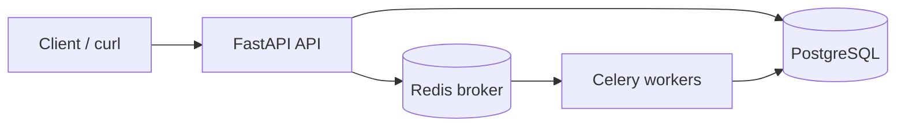

# TaskFlow

TaskFlow is a small backend where you POST a “job” and it doesn’t run in the HTTP reques. It goes through Redis, a Celery worker picks it up, Postgres stores status + results. The thought being to copy how real systems do long stuff without blocking the API.

Stack is FastAPI, Celery, Redis, Postgres, SQLAlchemy. Nothing fancy, just wired together in a simple way.

## What it does (roughly)

- You submit jobs with a `type` + `payload`.
- Worker runs them async, updates the row in the DB.
- If something blows up it retries a few times with backoff (configurable).
- There’s logs per job in the DB plus JSON-ish prints from the worker, and a `/metrics` route so you can see counts / avg time / retries.

Task types I implemented: `data_processing`, `api_aggregation`, `computation_task` (last one is fake CPU work on purpose).

## Diagram



## Stuff you need first

Python 3.11+ should work (I used newer python too, if pip complains thats a you problem lol).

Docker Desktop if you want the easy path for Redis + Postgres. Otherwise install them yourself and fix `.env`.

## How to run it (Docker path)

cd into the repo root where `compose.yaml` / `app/` / `worker/` live.

**1 — containers**

Postgres is mapped to **5433** on your machine on purpose bc a lot of people already have postgres chewing port 5432 locally.

```powershell
docker compose up -d
```

If your compose is old and whines about `include`, same thing but:

```powershell
docker compose -f docker/docker-compose.yml up -d
```

**2 — venv + pip**

```powershell
python -m venv .venv
.\.venv\Scripts\Activate.ps1
pip install -r requirements.txt
```

**3 — env**

You can skip `.env` if you’re using the compose file as-is (user/pass/taskflow, port 5433).

Or copy `.env.example` → `.env` and edit. Don’t commit `.env` obviously.

**4 — API (terminal 1)**

```powershell
uvicorn app.main:app --reload --reload-dir app --reload-dir worker
```

I pin reload dirs bc otherwise uvicorn watches `.venv` and restarts every time something touches site-packages which is annoying.

Docs: http://127.0.0.1:8000/docs

**5 — worker (terminal 2)**

On Windows Celery prefork + semaphores was a mess for me (`PermissionError`). This repo forces `solo` pool in `worker/celery_app.py` when you’re on win32. If it still freaks out:

```powershell
celery -A worker.celery_app:celery_app worker --loglevel=info --pool=solo
```

Linux/mac you can do concurrency if you want:

```bash
celery -A worker.celery_app:celery_app worker --loglevel=info --concurrency=2
```

**6 — quick test**

```powershell
curl -X POST http://127.0.0.1:8000/api/v1/jobs -H "Content-Type: application/json" -d "{\"type\":\"computation_task\",\"payload\":{\"iterations\":100000}}"
```

Grab the `job_id`, hit `GET /api/v1/jobs/{id}` until it’s done, then `/result`. `/metrics` is there too.

## Endpoints (prefix `/api/v1`)

| Method | Path | What |
| ------ | ---- | ---- |
| POST | `/jobs` | Submit |
| GET | `/jobs/{id}` | Status |
| GET | `/jobs/{id}/result` | Result when terminal |
| GET | `/jobs/{id}/logs` | Logs |
| GET | `/jobs` | List |
| GET | `/metrics` | Aggregates |
| GET | `/health` | Alive check |

## Job states

`pending` → `running` → `completed` or `failed`. Sometimes `retrying` shows up while it’s retrying.

## When things break

| Thing | What I usually did |
| ----- | ------------------ |
| `docker` not found | Install Docker Desktop, reopen terminal |
| password wrong for `taskflow` | You’re probably talking to the wrong postgres (local 5432 vs docker 5433). Fix `.env` or use the compose DB |
| jobs stuck `pending` | Worker not running or redis down |
| Windows celery semlock spam | `--pool=solo` (see above) |
| weird DB schema after git pull | `docker compose down -v` then up again (nukes volume data) |

## Folders

```
taskflow/
├── app/           # routes, models, tasks, etc
├── worker/        # celery app
├── docker/        # compose for postgres+redis
├── compose.yaml   # wrapper so you can `docker compose` from root
├── requirements.txt
└── README.md
```

## If someone asks what you learned

I usually say: queue + worker separates “accept request” from “do work”, retries are easier when state lives in Postgres, and you can scale workers without touching the API. Metrics/logs were me trying to not only demo happy path.

## License

MIT unless your class wants something else — swap it.
